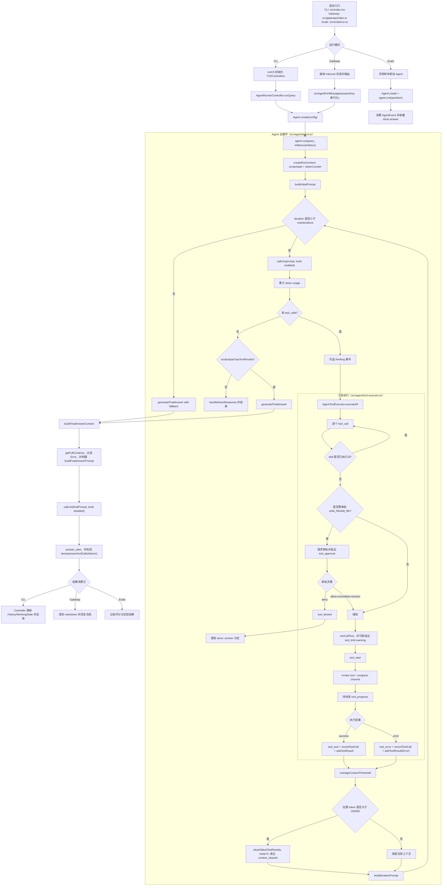

# Dexter `src/` 架构设计与运行流程（基于代码实现）

本文基于当前代码对 `src/` 进行严谨梳理，重点详细展开 `src/agent/` 的架构与执行流程，并给出覆盖完整运行链路的 Mermaid 流程图。

---

## 1. `src/` 总体分层架构

`src/` 可以分为 8 层（从入口到基础设施）：

1. **入口层（Entry）**
   - `src/index.tsx`：CLI 启动入口，加载 `.env` 后执行 `runCli()`
   - `src/gateway/index.ts`：Gateway（WhatsApp 通道）入口
   - `src/evals/run.ts`：评测入口（LangSmith + TUI）

2. **交互层（UI / Channel）**
   - CLI 交互：`src/cli.ts` + `src/components/*`
   - 外部通道：`src/gateway/*`（以 WhatsApp 插件为核心）

3. **控制层（Controllers）**
   - `src/controllers/agent-runner.ts`：管理一次 query 的状态机、事件聚合、审批交互
   - `src/controllers/model-selection.ts`：模型/Provider 选择流
   - `src/controllers/input-history.ts`：输入历史读取与持久化更新

4. **Agent 核心层（核心推理与工具循环）**
   - `src/agent/agent.ts`：主循环（LLM 调用、工具执行、终止条件）
   - `src/agent/tool-executor.ts`：工具执行器（审批、进度、错误、事件）
   - `src/agent/scratchpad.ts`：单次查询的事实记录与上下文管理
   - `src/agent/prompts.ts`：系统提示词、迭代提示词、最终回答提示词构建
   - `src/agent/final-answer-context.ts`：最终回答上下文拼装
   - `src/agent/run-context.ts`、`token-counter.ts`、`types.ts`：运行态、计量、事件协议

5. **工具层（Tools）**
   - 聚合与注册：`src/tools/registry.ts`
   - 金融工具：`src/tools/finance/*`
   - 搜索工具：`src/tools/search/*`（Exa/Perplexity/Tavily 条件启用）
   - 浏览器与抓取：`src/tools/browser/*`、`src/tools/fetch/*`
   - 文件系统工具：`src/tools/filesystem/*`
   - 技能工具：`src/tools/skill.ts`

6. **模型抽象层（Model）**
   - `src/model/llm.ts`：Provider 路由、模型实例化、重试、tool binding、结构化输出

7. **能力元数据层（Skills / Descriptions）**
   - `src/skills/*`：技能发现、加载、元数据注入
   - `src/tools/descriptions/*`：每个工具的系统提示描述

8. **基础设施层（Utils / Config / Store）**
   - `src/utils/*`：环境变量、持久化、token 估算、历史缓存、日志等

---

## 2. 运行入口与执行路径

### 2.1 CLI 主路径

- `index.tsx` 加载环境变量并进入 `runCli()`
- `cli.ts` 负责 TUI 组件装配、输入事件监听、状态渲染
- 用户提交 query 后，交给 `AgentRunnerController.runQuery()`
- Controller 创建 `Agent` 并流式消费 `agent.run()` 事件
- 事件驱动 UI 更新（thinking/tool_start/tool_end/answer_start/done）

### 2.2 Gateway 路径（WhatsApp）

- `gateway/index.ts` 启动 channel manager 和 WhatsApp 插件
- 收到 inbound 消息后：
  - 路由解析（agentId/sessionKey/accountId）
  - 会话元信息写入 session store
  - 启动 typing 指示循环
  - 调用 `runAgentForMessage()` 执行 Agent
  - 清洗 markdown 并回发结果
- `gateway/agent-runner.ts` 对同一 `sessionKey` 串行化执行（`tail` Promise 链）

### 2.3 Evals 路径

- `evals/run.ts` 使用同一 `Agent` 核心做离线评测
- 每个样本都以 `Agent.create(...).run(question)` 获取答案

---

## 3. `src/agent/` 详细架构（重点）

`src/agent/` 是一个“事件流驱动的工具增强推理循环”，核心目标是：

1. 在可控迭代内持续调用 LLM + 工具，逐步逼近答案；
2. 保留完整工具结果作为事实依据；
3. 在上下文压力下按策略清理迭代上下文，同时为最终回答恢复完整有效数据；
4. 全过程向上游 UI/Channel 流式发事件。

### 3.1 模块职责分解

#### A. `agent.ts`（主编排器）

负责单次 query 的核心 loop：

- 初始化：
  - 创建 `RunContext`（`scratchpad` + `tokenCounter` + `iteration`）
  - 构建初始 prompt（含历史用户 query 列表）
- 每轮迭代：
  - 调用 `callLlm(prompt, {tools})`
  - 记录 token usage
  - 若有 tool_calls：先发 thinking（如果有文本），再执行工具
  - 若无 tool_calls：进入终止路径（直接答复 or 最终回答生成）
  - 执行完工具后做上下文阈值管理（context clearing）
  - 生成下一轮迭代 prompt
- 退出条件：
  - 工具被拒绝 -> 立即 `done`（空 answer）
  - 无工具调用且无历史工具结果 -> 直接答复
  - 无工具调用且已有工具结果 -> final answer 模式
  - 达到最大迭代数 -> final answer + fallback 文案

#### B. `tool-executor.ts`（工具执行器）

`AgentToolExecutor.executeAll()` 逐个执行 LLM 返回的 tool calls：

- **技能去重**：同一 query 中相同 `skill` 只执行一次
- **审批机制**：`write_file`、`edit_file` 需要审批
  - `allow-once`：仅本次
  - `allow-session`：将需要审批的工具加入会话白名单（当前实现中批量加入 `write_file` 和 `edit_file`）
  - `deny`：发 `tool_denied` 并结束本次运行
- **软限流提示**：读取 `scratchpad.canCallTool`，仅 warning 不阻断
- **进度流**：通过 progress channel 发 `tool_progress`
- **结果写回**：
  - 成功：`tool_end` + `recordToolCall` + `addToolResult`
  - 失败：`tool_error` + 同样记入调用 + 以 `Error: ...` 写入 scratchpad

#### C. `scratchpad.ts`（单次查询事实账本）

这是单次 query 的“真实数据来源”，也是最终回答依据：

- **持久化格式**：`.dexter/scratchpad/*.jsonl`，append-only
- **记录类型**：`init` / `thinking` / `tool_result`
- **工具调用统计与相似查询检测**：
  - 记录每个工具调用次数
  - 基于词集合重叠（Jaccard-like）检测相似 query，给 LLM 警告避免重试死循环
- **上下文清理（in-memory）**：
  - 不改 JSONL 文件本体
  - 仅在“发给模型的迭代上下文”中将老 tool_result 标记为 cleared
- **导出接口差异**（非常关键）：
  - `getToolResults()`：用于迭代 prompt，受 cleared 影响
  - `getActiveToolResults()`：仅未清理结果
  - `getFullContexts()`：返回全部工具结果（含曾被 cleared 的）
  - `getToolCallRecords()`：用于 done event 对外回传

#### D. `prompts.ts`（提示词生成）

- `buildSystemPrompt(model)`：
  - 注入工具说明（来自 registry）
  - 注入可用技能元数据
  - 内置工具使用策略（如金融优先 `financial_search`）
- `buildIterationPrompt(...)`：
  - 包含原 query + 已获取工具数据 + 工具使用状态提示
  - 约束 agent 继续推进而非过早停止
- `buildFinalAnswerPrompt(...)`：
  - 输入 query + 完整上下文数据
  - 指导在数据不完整时也给出基于现有信息的回答

#### E. `final-answer-context.ts`（最终回答上下文拼装）

- 从 `scratchpad.getFullContexts()` 获取全部工具结果
- 过滤掉 `Error:` 结果
- 用 `getToolDescription()` 生成可读标题
- JSON 可解析时美化为 json code block，提升 final call 的可读性

#### F. `run-context.ts` / `token-counter.ts` / `types.ts`

- `RunContext`：聚合 query 生命周期状态
- `TokenCounter`：累计 input/output/total tokens 并计算吞吐
- `types.ts`：事件协议（thinking/tool_start/tool_progress/tool_end/tool_error/tool_approval/tool_denied/tool_limit/context_cleared/answer_start/done）

### 3.2 上下文管理机制（严谨说明）

该项目采用“迭代上下文可裁剪 + 最终回答上下文尽量完整”的双态策略：

1. 迭代阶段，每轮估算 token：
   - 估算公式：`chars / 3.5`
   - 阈值：`CONTEXT_THRESHOLD = 100000`
2. 超阈值时清理最旧工具结果，保留最近 `KEEP_TOOL_USES = 5`
3. 清理只影响迭代上下文，不影响落盘 JSONL
4. 最终回答阶段重新读取 full contexts，并过滤错误项后构建回答输入

这使得中间迭代可控，同时尽量降低最终答复的信息损失。

### 3.3 Agent 与上层 Controller 的协作协议

- `Agent` 只做“推理与工具编排”，不直接关心 UI
- `AgentRunnerController` 负责：
  - 创建/取消执行（AbortController）
  - 处理审批请求（Promise 交互）
  - 将底层事件聚合为 UI 可渲染的 `DisplayEvent`
  - 回填历史与统计信息（duration/token/tps）

这种分层让 `Agent` 能被 CLI、Gateway、Evals 复用。

---

## 4. 全流程 Mermaid 流程图（覆盖 CLI/Gateway + Agent 细节）

---

## 5. 关键设计特性与约束

1. **Agent 与界面解耦**  
   Agent 输出统一事件流，CLI/Gateway/Evals 仅做消费与展示/投递。

2. **工具调用可观测性高**  
   从 `tool_start` 到 `tool_progress` 到 `tool_end/error` 全链路可追踪。

3. **审批机制内建到执行链路**  
   对写入类文件工具执行前强制审批，且支持 session 级授权。

4. **软限流不是硬阻断**  
   `canCallTool` 只警告不拦截，避免过度中断任务，同时提醒模型切换策略。

5. **上下文清理与最终回答恢复解耦**  
   迭代阶段为控窗清理；最终阶段回读完整成功结果，降低信息丢失风险。

6. **多入口复用同一核心 Agent**  
   CLI、Gateway、Evals 均共享同一 agent 循环，行为一致性较好。

---

## 6. 当前实现中的注意点（基于代码事实）

- `InMemoryChatHistory` 中存在“相关消息选择”能力（`selectRelevantMessages`），但 `Agent.buildInitialPrompt()` 当前使用的是 `getUserMessages()` 的全部用户 query 列表，不是按相关性筛选后的上下文。
- `buildFinalAnswerContext()` 使用 `getFullContexts()`，因此最终回答会使用全部历史工具结果（过滤错误后），不受迭代阶段 context clearing 的影响。
- `tool_denied` 是强终止路径：一旦拒绝敏感工具，本轮 agent 直接 `done`，answer 为空字符串。
- 会话级审批 `allow-session` 的实现会把审批清单中的工具统一加入会话白名单（当前是 `write_file` 与 `edit_file`）。
